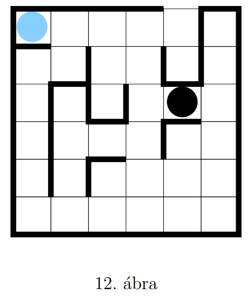

# Labirintus

TODO: a detailed description of your project (must contain at least the original description of the assignment)

A 12. ábrán egy labirintus látható, melybe egy világos koronggal jelzett
figurát és egy sötét koronggal jelzett szörnyet helyezünk.  
Feladatunk a figura kijuttatása a labirintusból a kijáraton át úgy, hogy
közben a szörny nem kapja el. A figura függőlegesen és vízszintesen mozoghat
egy mezőt, és nem léphet át az ábrán vastag vonallal jelzett falakon.
A figura minden egyes lépése maga után vonja a szörny elmozdulását. A
szörny minden esetben két mezőt próbál lépni úgy, hogy közelebb kerüljön a
figurához, mozgása során pedig előnyben részesíti a vízszintes irányú elmozdulást.

Összefoglalva, az alábbi algoritmus szerint mozog:
1. Ha balra vagy jobbra mozoghat egy mezőt, miközben közelebb kerül a
   figurához, akkor lépjen az adott irányba.
   - (a) Ha még egyet léphet balra vagy jobbra, miközben közelebb kerül
   a figurához, akkor lépjen az adott irányba.
   - (b) Egyébként ha még egyet léphet felfelé vagy lefelé, miközben közelebb
   kerül a figurához, akkor lépjen az adott irányba.

2. Egyébként ha felfelé vagy lefelé mozoghat egy mezőt, miközben közelebb
   kerül a figurához, akkor lépjen az adott irányba.
   - (a) Ha még egyet léphet balra vagy jobbra, miközben közelebb kerül
   a figurához, akkor lépjen az adott irányba.
   - (b) Egyébként ha még egyet léphet felfelé vagy lefelé, miközben közelebb
   kerül a figurához, akkor lépjen az adott irányba.

## Egy lehetséges megoldás:

1. RIGHT
2. DOWN
3. LEFT
4. DOWN
5. DOWN
6. DOWN
7. DOWN
8. RIGHT
9. UP
10. UP
11. RIGHT
12. RIGHT
13. UP
14. RIGHT
15. RIGHT
16. UP
17. UP
18. DOWN
19. DOWN
20. DOWN
21. DOWN
22. DOWN
23. LEFT
24. LEFT
25. LEFT
26. LEFT
27. LEFT
28. UP
29. UP
30. UP
31. UP
32. RIGHT
33. UP
34. DOWN
35. LEFT
36. DOWN
37. DOWN
38. DOWN
39. DOWN
40. RIGHT
41. LEFT
42. RIGHT
43. UP
44. UP
45. RIGHT
46. RIGHT
47. DOWN
48. RIGHT
49. RIGHT
50. DOWN
51. UP
52. UP
53. UP
54. LEFT
55. LEFT
56. UP
57. UP
58. RIGHT
59. UP